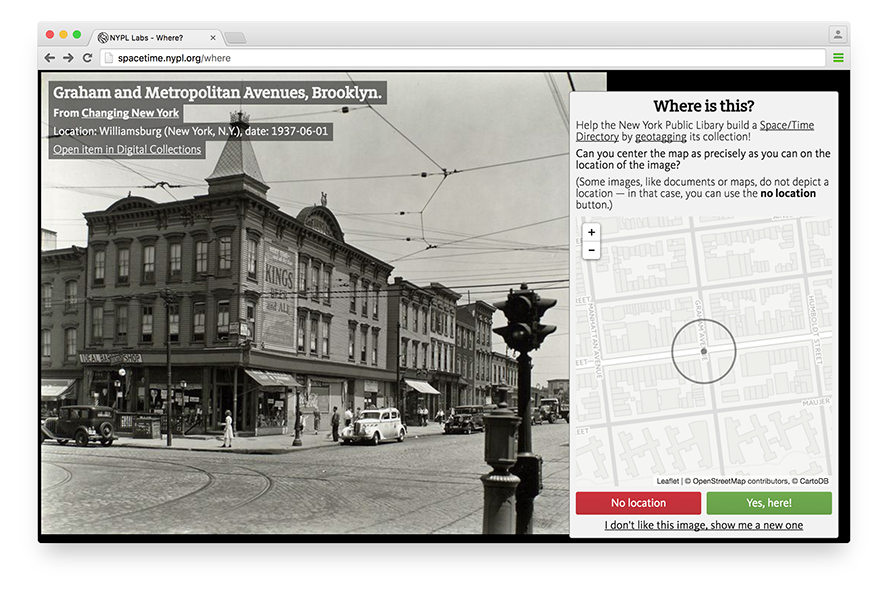

# Space/Time Directory - Surveyor

See http://spacetime.nypl.org/surveyor/.

Surveyor is a web application (and [Chrome Extension](https://github.com/nypl-spacetime/surveyor-tab)) for crowdsourced image geotagging. Surveyor is part of the [NYC Space/Time Directory project](http://spacetime.nypl.org/).

## Example

From:



To:

```json
{
  "type": "FeatureCollection",
  "features": [
    {
      "type": "Feature",
      "properties": {
        "uuid": "510d47d9-4ec5-a3d9-e040-e00a18064a99",
        "imageId": "482572",
        "step": "location",
        "url": "http://digitalcollections.nypl.org/items/510d47d9-4ec5-a3d9-e040-e00a18064a99"
      },
      "geometry": {
        "type": "Point",
        "coordinates": [
          -73.944441,
          40.714447
        ]
      }
    }
  ]
}

```

See the [GeoJSON file](example/data.geojson) in the `example` directory for a complete data file, including bearing information.

## Chrome Extension

(and [Chrome Extension](https://github.com/nypl-spacetime/surveyor-tab))

## Installation & Usage

First, clone the GitHub repository:

    git clone https://github.com/nypl-spacetime/surveyor.git

Then, install all Node.js dependencies:

    cd surveyor
    npm install

Install a local version of the [Surveyor API](https://github.com/nypl-spacetime/surveyor-api), see its [README](https://github.com/nypl-spacetime/surveyor-api) for installation instructions.

To start a development version on [http://localhost:3001](http://localhost:3001), run:

    npm start

You can change the default port by editing [`config/default.yml`](config/default.yml).

## API

brick-by-brick

See [brick-by-brick](https://github.com/nypl-spacetime/brick-by-brick).

## Other image collections

Currently, Surveyor works with images from NYPL's [Digital Collections](http://digitalcollections.nypl.org/). However, it's very easy to add images from other, non-NYPL collections.

## Public Domain Thank You Animals

- [Chinese owl](http://digitalcollections.nypl.org/items/510d47da-9f1f-a3d9-e040-e00a18064a99)
- [Wrinkle-lipped free-tailed bat](http://digitalcollections.nypl.org/items/510d47da-9ed9-a3d9-e040-e00a18064a99)
- [Asiatic wildcat](http://digitalcollections.nypl.org/items/510d47da-9eda-a3d9-e040-e00a18064a99)
- [Black-necked stork](http://digitalcollections.nypl.org/items/510d47da-9f5a-a3d9-e040-e00a18064a99)
- [Tawny eagle](http://digitalcollections.nypl.org/items/510d47da-b502-a3d9-e040-e00a18064a99)
