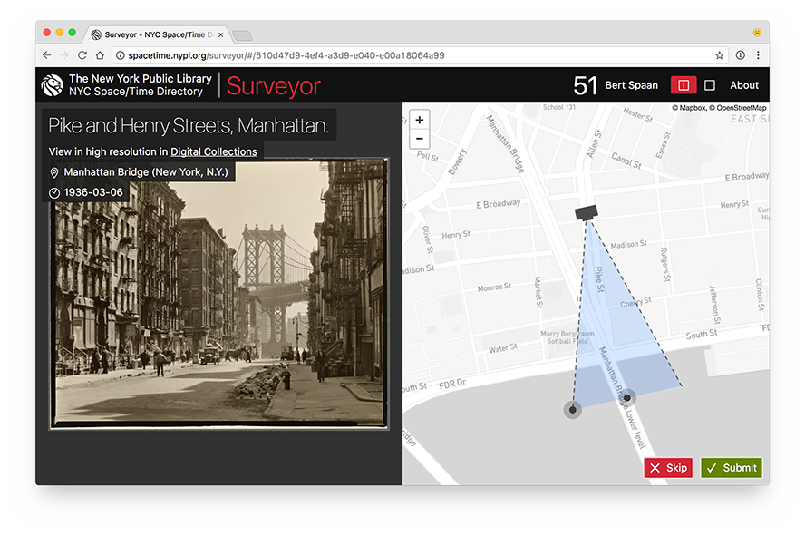
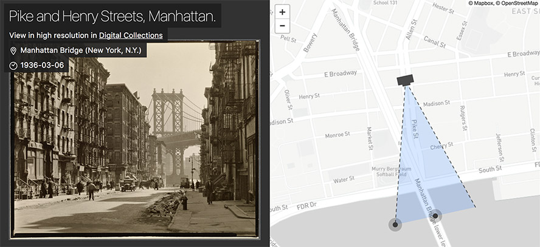

# NYC Space/Time Directory - Surveyor

__Visit [Surveyor](http://spacetime.nypl.org/surveyor/)!__

Help [The New York Public Library](https://www.nypl.org/) put New York City’s history on the map!

Surveyor is a geotagging tool designed to enhance the metadata of items within [NYPL Digital Collections](https://digitalcollections.nypl.org/). It allows you to view and place images on a map of New York City. With each contribution through Surveyor, users create new knowledge about the Library’s collections!

For more information, see Surveyor’s [About page](http://spacetime.nypl.org/surveyor/#about).

Surveyor was created for geotagging NYPL's collections, however, __it's easy to adapt Surveyor and use it to geotag any collection of photos.__ As long as your images are available online and have unique identifiers as well as basic metadata, you can use Surveyor. To find out how, see [Other Image Collections](#other-image-collections) below.

[](http://spacetime.nypl.org/surveyor/#/510d47d9-4ef4-a3d9-e040-e00a18064a99)

## NYC Space/Time Directory

Maps by Decade is part of the [NYC Space/Time Directory](http://spacetime.nypl.org/). The goal of this project is to&mdash;through a variety of resources&mdash;unlock the potential of historical maps and provide opportunities to explore urban history across space and time.

Major support for the NYC Space/Time Directory is provided by the [Knight News Challenge](http://www.knightfoundation.org/grants/6715), an initiative of the [John S. and James L. Knight Foundation](http://www.knightfoundation.org/).


## Technology

Surveyor uses the following open source libraries:

- __[Leaflet.GeotagPhoto](https://github.com/nypl-spacetime/Leaflet.GeotagPhoto)__: Leaflet plugin for photo geotagging
- __[brick-by-brick](https://github.com/nypl-spacetime/brick-by-brick)__: Simple JSON API for requesting and storing crowdsourcing data
- __[`react-boilerplate`](https://github.com/react-boilerplate/react-boilerplate)__: React + Redux + millions of other dependencies, but at least it works
- __[NYPL's Digital Collections API](http://api.repo.nypl.org/)__: Metadata API for Digital Collections items and collections

## Data

For each image for which users submit data, Surveyor collects geospatial information about the location where the photo was taken, as well as the direction and angle of the view of the image. For example, let's have a look at the screenshot above, showing the geotagging of a photo titled [_Pike and Henry Streets, Manhattan_](https://digitalcollections.nypl.org/items/510d47d9-4ef4-a3d9-e040-e00a18064a99). The most important part of the screenshot is shown in more detail below:



The photographer stands on the corner of Pike Street and Henry Street in Manhattan, pointing his camera south, towards the Manhattan Bridge and the East River. A user correctly geotagging the photo, would place the camera marker on that street intersection, and point the field of view south, as shown in the screenshot. Submitting this data would have Surveyor send this data to its database as a GeoJSON file of the following form:

```json
{
  "type": "Feature",
  "properties": {
    "angle": 36,
    "bearing": 170,
    "distance": 495
  },
  "geometry": {
    "type": "GeometryCollection",
    "geometries": [
      {
        "type": "Point",
        "coordinates": [
          -73.992533,
          40.7130856
        ]
      },
      {
        "type": "LineString",
        "coordinates": [
          [
            -73.9896355,
            40.7089532
          ],
          [
            -73.9933933,
            40.7084511
          ]
        ]
      }
    ]
  }
}
```

Surveyor uses the [`field-of-view`](https://github.com/nypl-spacetime/field-of-view) library to generate this GeoJSON Feature and to compute the angle, bearing and distance. You can use [geojson.io](http://geojson.io/#data=data:application/json,%7B%22type%22%3A%22Feature%22%2C%22properties%22%3A%7B%22angle%22%3A36%2C%22bearing%22%3A170%2C%22distance%22%3A495%7D%2C%22geometry%22%3A%7B%22type%22%3A%22GeometryCollection%22%2C%22geometries%22%3A%5B%7B%22type%22%3A%22Point%22%2C%22coordinates%22%3A%5B-73.992533%2C40.7130856%5D%7D%2C%7B%22type%22%3A%22LineString%22%2C%22coordinates%22%3A%5B%5B-73.9896355%2C40.7089532%5D%2C%5B-73.9933933%2C40.7084511%5D%5D%7D%5D%7D%7D) to view this GeoJSON object on a map.

Once a user clicks the Submit button, Surveyor sends the GeoJSON data to [brick-by-brick](https://github.com/nypl-spacetime/brick-by-brick), an API for crowdsourcing tasks and submissions (and part of the NYC Space/Time Directory). Brick-by-brick is [explained in more detail below](#api).

When enough locations are submitted for a single image (for now, we require each image to be geotagged by at least five people), an algorithm will remove outliers, and try to determine the best submission. More information about this algorithm will be posted here soon.

All geotagged images will  data will eventually be published as a [dataset in the NYC Space/Time Directory](http://spacetime.nypl.org/#data).
